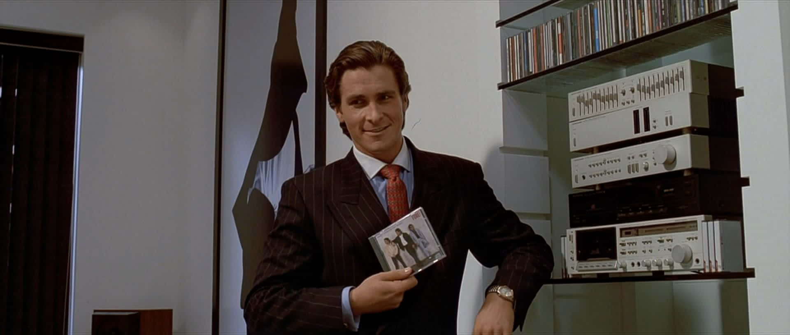

# Difference Of Gaussians
### Implementation of difference of gaussians (Extended & Filtered)
 
Exploring difference of gaussians as a low pass filter which can eliminate high frequencies that in the context of image processing corresponds to edges.
 

# 1) Extended DoG
It works by simply subtracting 2 gaussians (multiplied by a sharpening factor) that convolve on the whole image, the effect can be further stylized by thresholding the final result.
 
Increasing the sharpeness factor allow the filter to detect more edges, however it introduces a new problem.
 
 

 

# 2) Filtered DoG
Extended DoG does a good job of detecting edges especially when we increase sharpness, however this makes it so obvious how much the image is affected by noise.
 
In order to avoid the noise we are going to do a 2-pass effect instead of just calculating the DoG directly on the original image.
 
The first pass is to apply the gaussian filter in the direction of *gradient* (recall the gradient is the maximum rate of change which in our case *edges*).  
In order to do this however we need to get what is known as *Vector Field* which is aligned to the local edge orientation.  
 
We first get the Structure Tensor of the image. We then calculate the eigenvalues and their corresponding eigenvector, we are only interested about the minor eigenvector which points in the direction of the gradient.  
In my implementation I used this [package](https://github.com/Skielex/structure-tensor) which really simplimfies the process of generating the vector field.
We then do a 1d gaussian blur in direction of the gradient using the help of the vector field.
 
 

 
 
We then start doing the second pass which filters along the flow curves induced by the tangent field.
 
 

 
 
We can then apply the FDoG again on the image to further eliminate the noise and smooth the image.
 
 

 
 

# Examples
## 1) CyperPunk
 
 

  

  

## 2) American Psycho

  

  

# TODO
1) Implement anti-aliasing to the final image.
2) Use cupy to speed up the process.
